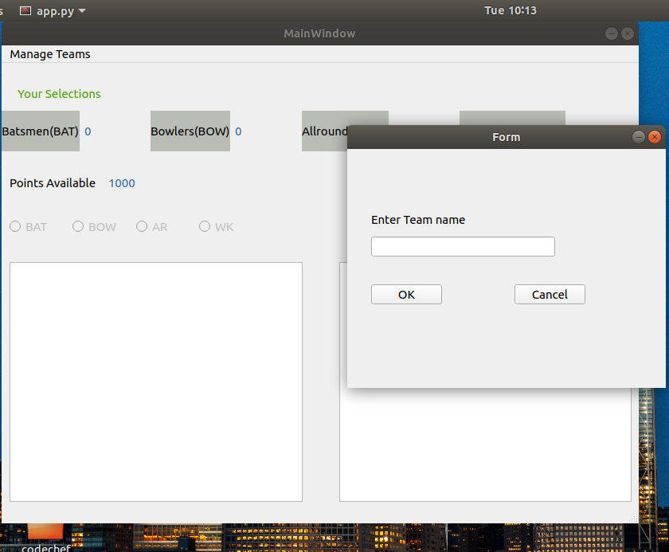
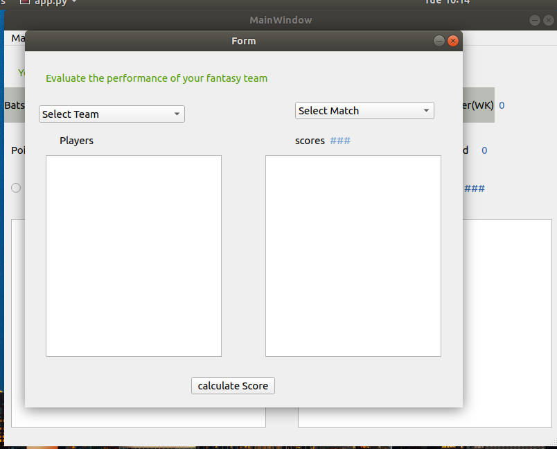

# Fantasy Cricket Game


----
## Table of Contents
---
* [Description](#description)
* [Technologies](#technologies)
* [Setup](#setup)

----


## Description
---
* It is an online game where you create a virtual team of real cricket players and score points
depending on how your chosen players perform in real life matches.


* To win a tournament,
you must try and get the maximum points and the No. 1 rank amongst other participants.

**Screenshots**

---

---


## Technologies
---
* Python 3.x
* sqlite3 db
* PyQt5


## setup
---
<p> For Python 2.7</p>

```
pip install requirements.txt
```

<p>For Python 3.x</p>

```
pip3 install requirements.txt
```
<p>Then run app.py</p>

```
python app.py
```
<p>if above one doesn't work</p>

```
python3 app.py
```
